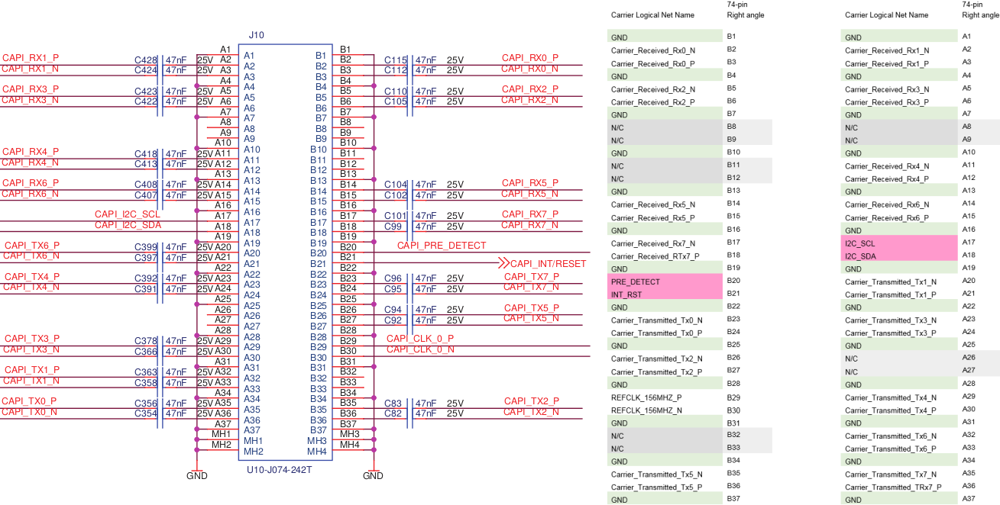

**Work-in-Progress** - [Second Revision Gerbers ready but not yet ordered](https://github.com/mwrnd/OpenCAPI-to-PCIe/releases/tag/v0.2-alpha). I was unable to get the first revision working with the Innova-2. The [OpenPower version of the AAC Spec](https://files.openpower.foundation/s/xSQPe6ypoakKQdq/download/25Gbps-spec-20171108.pdf) I used has a different pinout than the [ADM-PCIE-9V5 User Manual (Pg15-19of38)](https://www.alpha-data.com/xml/user_manuals/adm-pcie-9v5%20user%20manual_v1_4.pdf).

# PCIe to OpenCAPI-Compatible SlimSAS8x

The [Open Coherant Accelerator Processor Interface (OpenCAPI)](https://opencapi.org/wp-content/uploads/2022/07/OpenCAPI-Overview.pdf) [was a standard](https://opencapi.org/2022/08/09/cxl-consortium-and-opencapi-consortium-sign-letter-of-intent-to-transfer-opencapi-specifications-to-cxl/) that had FPGA-based [Advanced Accelerated Cable (AAC)](https://files.openpower.foundation/s/xSQPe6ypoakKQdq/download/25Gbps-spec-20171108.pdf) [Add-In cards](https://opencapi.org/wp-content/uploads/2018/12/OpenCAPI-Tech-SC18-Exhibitor-Forum.pdf) such as [ADM-PCIE-9H3](https://www.alpha-data.com/product/adm-pcie-9h3/), [ADM-PCIE-9H7](https://www.alpha-data.com/alpha-data-release-adm-pcie-9h7-data-center-board-with-xilinx-virtex-ultrascale-hbm-fpga/), [ADM-PCIE-9V3](https://www.alpha-data.com/product/adm-pcie-9v3/), [ADM-PCIE-9V5](https://www.alpha-data.com/product/adm-pcie-9v5/), [BittWare XUP-VV4](https://www.bittware.com/fpga/xup-vv4/), [BittWare XUP-VVH](https://www.bittware.com/fpga/xup-vvh/), and [Nvidia Innova-2 Flex](https://www.nvidia.com/en-us/networking/ethernet/innova-2-flex/).

The OpenCAPI SlimSAS interface is based on [PCI-Express](https://en.wikipedia.org/wiki/PCI_Express). This project is an attempt to create an adapter capable of connecting to such FPGA boards using PCIe over SlimSAS cables.

# PCB Layout

4-Layer PCB. Inner 2 layers are GND planes. Differential pairs are matched to a length of 65mm +/- 1mm both inter-pair and intra-pair (N-to-P).

# Schematic

## Design Notes

Refer to the [ADM-PCIE-9V5 User Manual (Pg15-19of38)](https://www.alpha-data.com/xml/user_manuals/adm-pcie-9v5%20user%20manual_v1_4.pdf). Useful [High Speed Design presentation](https://www.youtube.com/watch?v=QG0Apol-oj0&t=2832s).

Only a single component is required for the adapter, a [U10A474200T](https://www.digikey.com/en/products/detail/amphenol-cs-commercial-products/U10A474200T/14632855)/[U10A474240T](https://www.digikey.com/en/products/detail/amphenol-cs-commercial-products/U10A474240T/17066204) SlimSAS 8x Right-Angle SMD Connector. A SlimSAS 8x Cable is required to use the PCB with an OpenCAPI FPGA Board.

### PCB Stackup

I am using values from [JLCPCB](https://jlcpcb.com/capabilities/pcb-capabilities).

### Trace Impedance Control

OpenCAPI uses 85ohm impedance cables. I played with the values until I got the loosest differential pair coupling that is manufacturable with larger tolerances.

