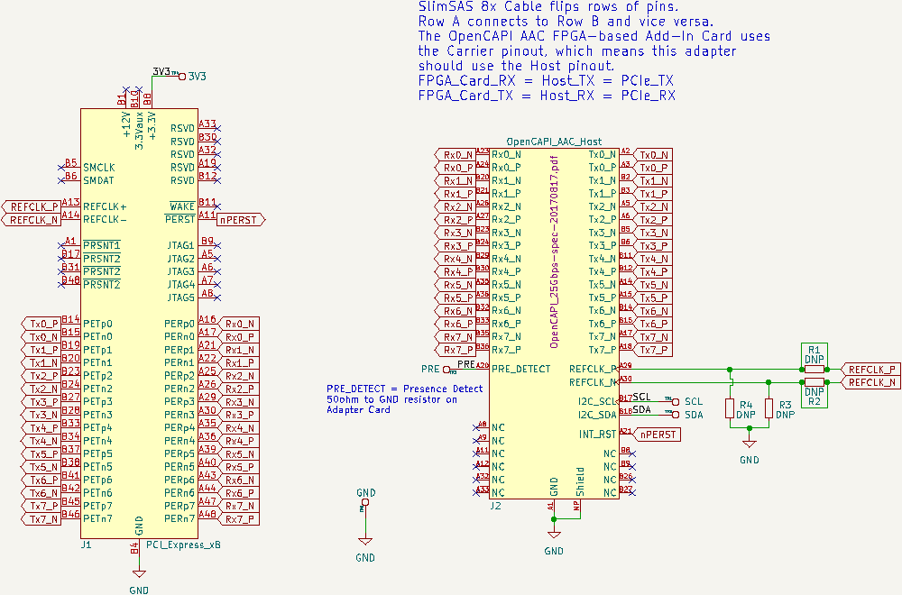
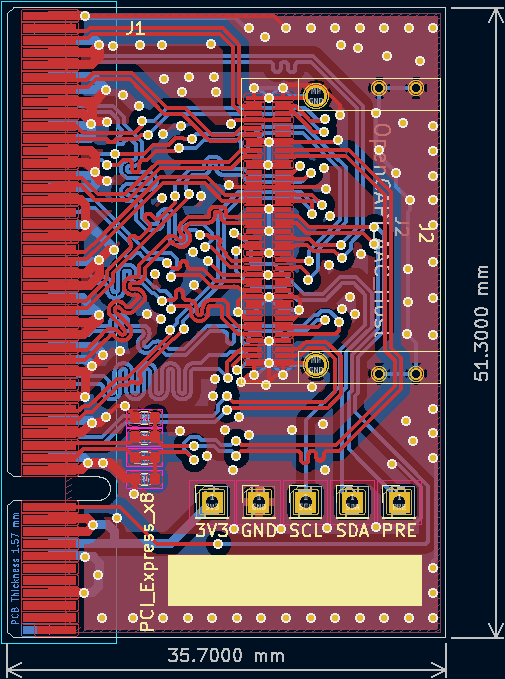
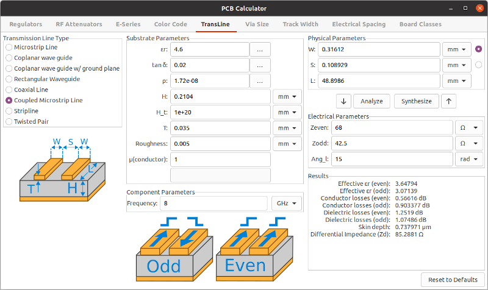

**Work-in-Progress** - First Revision Complete. Waiting for PCB.

PCI-Express to OpenCAPI-Compatible SlimSAS 8x Connector Compatible Adapter PCB.

# PCIe-to-SlimSAS8x

The [Open Coherant Accelerator Processor Interface (OpenCAPI)](https://opencapi.org/wp-content/uploads/2022/07/OpenCAPI-Overview.pdf) standard has FPGA-based [Advanced Accelerated Cable (AAC)](https://files.openpower.foundation/s/xSQPe6ypoakKQdq/download/25Gbps-spec-20171108.pdf) [Add-In cards](https://opencapi.org/wp-content/uploads/2018/12/OpenCAPI-Tech-SC18-Exhibitor-Forum.pdf) such as [ADM-PCIE-9H3](https://www.alpha-data.com/product/adm-pcie-9h3/), [ADM-PCIE-9H7](https://www.alpha-data.com/alpha-data-release-adm-pcie-9h7-data-center-board-with-xilinx-virtex-ultrascale-hbm-fpga/), [ADM-PCIE-9V3](https://www.alpha-data.com/product/adm-pcie-9v3/), [ADM-PCIE-9V5](https://www.alpha-data.com/product/adm-pcie-9v5/), [BittWare XUP-VV4](https://www.bittware.com/fpga/xup-vv4/), [BittWare XUP-VVH](https://www.bittware.com/fpga/xup-vvh/), and [Nvidia Innova-2 Flex](https://www.nvidia.com/en-us/networking/ethernet/innova-2-flex/).

The OpenCAPI SlimSAS interface was designed as a low-latency version of [PCI-Express](https://en.wikipedia.org/wiki/PCI_Express) and includes all necessary signals. This project is an attempt to create an adapter capable of connecting to such FPGA boards using PCIe over SlimSAS cables.

# Schematic

# PCB Layout

4-Layer PCB. Inner 2 layers are GND planes.

## Design Notes

Refer to the [OpenPower Advanced Accelerated Cable (AAC) Electro-Mechanical Specification](https://files.openpower.foundation/s/xSQPe6ypoakKQdq/download/25Gbps-spec-20171108.pdf).

Only a single component is required, a [U10A474200T](https://www.digikey.com/en/products/detail/amphenol-cs-commercial-products/U10A474200T/14632855)/[U10A474240T](https://www.digikey.com/en/products/detail/amphenol-cs-commercial-products/U10A474240T/17066204) SlimSAS 8x Right-Angle SMD Connector.

This is meant to be an early prototype board.

Differential pairs are matched to within 0.5mm Intra-Pair (N-to-P). The first and last two pairs (RX0-RX1, RX6-RX7, TX0-TX1, TX6-TX7) are matched to within 10mm inter-pair. The current aim is to test the design at PCIe x1 and x2. Not yet certain if the pairs are in the correct order. Should at least work at [Gen1](https://www.youtube.com/watch?v=QG0Apol-oj0).

| Diff. Pair | Length (mm) |
| -----------|:-----------:|
| RX0        | 40.2        |
| RX1        | 30.7        |
| RX2        | 34.7        |
| RX3        | 19.8        |
| RX4        | 18.6        |
| RX5        | 30.0        |
| RX6        | 19.2        |
| RX7        | 22.1        |
| TX0        | 35.1        |
| TX1        | 35.5        |
| TX2        | 35.9        |
| TX3        | 26.6        |
| TX4        | 23.0        |
| TX5        | 44.4        |
| TX6        | 38.7        |
| TX7        | 47.2        |

### PCB Stackup

I am using values from [JLCPCB](https://jlcpcb.com/capabilities/pcb-capabilities).
 

### Trace Impedance Control

OpenCAPI uses 85ohm impedance cables. I played with the values until I got the loosest differential pair coupling that is manufacturable with larger tolerances.

