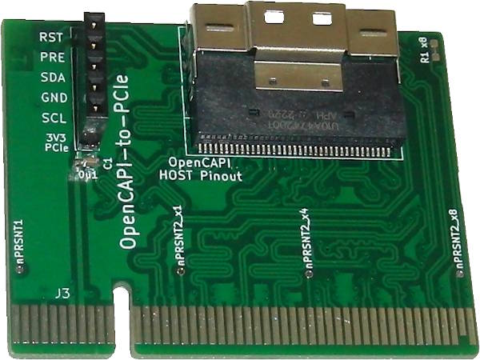
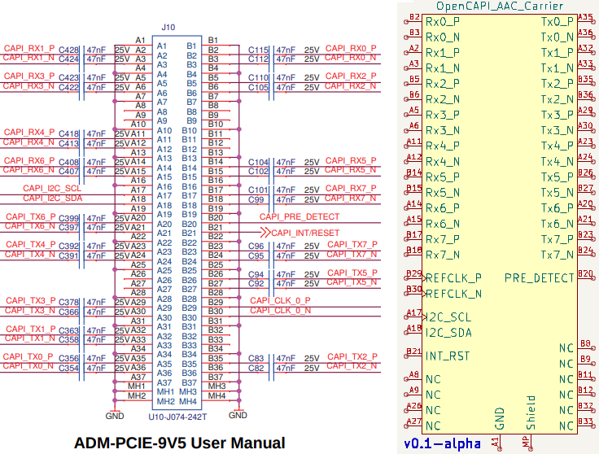
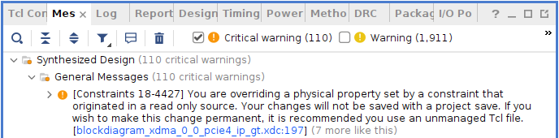
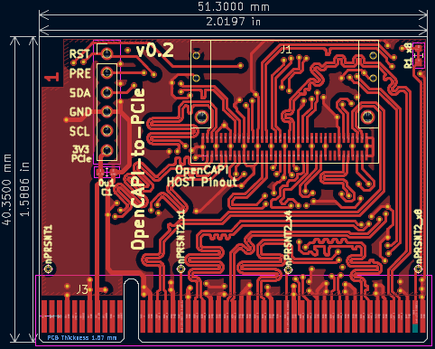
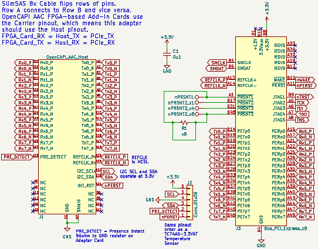
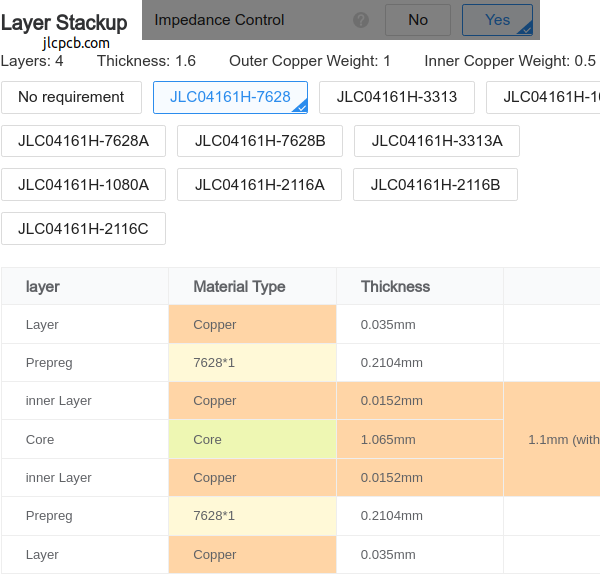
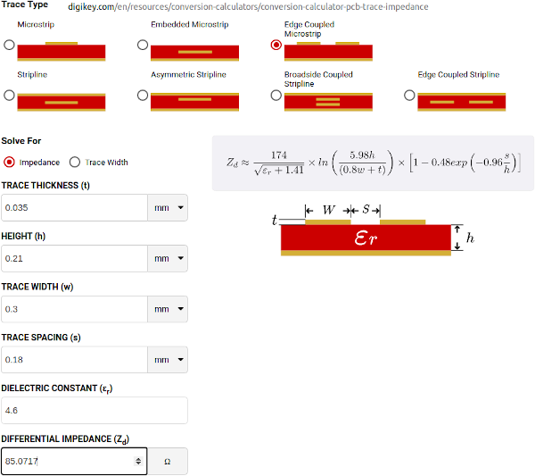

# PCIe to OpenCAPI-Compatible SlimSAS 8x

The [Open Coherant Accelerator Processor Interface (OpenCAPI)](https://opencapi.org/wp-content/uploads/2022/07/OpenCAPI-Overview.pdf) [was a standard](https://opencapi.org/2022/08/09/cxl-consortium-and-opencapi-consortium-sign-letter-of-intent-to-transfer-opencapi-specifications-to-cxl/) that had FPGA-based [Advanced Accelerated Cable (AAC)](https://files.openpower.foundation/s/xSQPe6ypoakKQdq/download/25Gbps-spec-20171108.pdf) [Add-In cards](https://opencapi.org/wp-content/uploads/2018/12/OpenCAPI-Tech-SC18-Exhibitor-Forum.pdf) such as [ADM-PCIE-9H3](https://www.alpha-data.com/product/adm-pcie-9h3/), [ADM-PCIE-9H7](https://www.alpha-data.com/alpha-data-release-adm-pcie-9h7-data-center-board-with-xilinx-virtex-ultrascale-hbm-fpga/), [ADM-PCIE-9V3](https://www.alpha-data.com/product/adm-pcie-9v3/), [ADM-PCIE-9V5](https://www.alpha-data.com/product/adm-pcie-9v5/), [BittWare XUP-VV4](https://www.bittware.com/fpga/xup-vv4/), [BittWare XUP-VVH](https://www.bittware.com/fpga/xup-vvh/), and [Nvidia Innova-2 Flex](https://www.nvidia.com/en-us/networking/ethernet/innova-2-flex/).

The OpenCAPI SlimSAS interface is based on [PCI-Express](https://en.wikipedia.org/wiki/PCI_Express). This project is an adapter capable of connecting such FPGA boards to host systmes with PCIe.



This design uses the OpenCAPI pinout from the [ADM-PCIE-9V5 User Manual (Pg15-19of38)](https://www.alpha-data.com/xml/user_manuals/adm-pcie-9v5%20user%20manual_v1_4.pdf):



The only OpenCAPI board I have to test against is the **Innova-2 MNV303212A-ADLT Rev:A2** and I designed the [OpenCAPI-to-PCIe_for_MNV303212A_RevA2](https://github.com/mwrnd/OpenCAPI-to-PCIe_for_MNV303212A_RevA2) project as an optimized variant of this design for that board.


## Issues when used with the Innova-2 MNV303212A RevA2

The [current v0.2 release](https://github.com/mwrnd/OpenCAPI-to-PCIe/releases/tag/v0.2) of this project worked with the [First Release of the `innova2_xdma_opencapi`](https://github.com/mwrnd/innova2_xdma_opencapi/tree/348716249bafc39514cb1a422a8e2fb5f301f859) project:

```
git clone --revision=348716249bafc39514cb1a422a8e2fb5f301f859 https://github.com/mwrnd/innova2_xdma_opencapi.git
wget https://github.com/mwrnd/innova2_xdma_opencapi/releases/download/v0.1/innova2_xdma_opencapi_bitstream.zip
```

But, it required a [non-standard GTY Channel to PCIe Lane mapping](https://github.com/mwrnd/innova2_xdma_opencapi/blob/348716249bafc39514cb1a422a8e2fb5f301f859/compile.tcl#L14) that Vivado complains about:



The [OpenCAPI-to-PCIe_for_MNV303212A_RevA2](https://github.com/mwrnd/OpenCAPI-to-PCIe_for_MNV303212A_RevA2) project is a version of this adapter optimized for the Innova-2 **MNV303212A Rev:A2**.


# PCB Layout

4-Layer PCB. Inner 2 layers are GND planes. Differential pairs are matched to a length of 65mm +/- 1mm both inter-pair and intra-pair (N-to-P).




# Schematic




## Design Notes

Refer to the [ADM-PCIE-9V5 User Manual (Pg15-19of38)](https://www.alpha-data.com/xml/user_manuals/adm-pcie-9v5%20user%20manual_v1_4.pdf). Useful [High Speed Design presentation](https://www.youtube.com/watch?v=QG0Apol-oj0&t=2832s).

Only a single component is needed for the adapter, a [U10A474200T](https://www.digikey.com/en/products/detail/amphenol-cs-commercial-products/U10A474200T/14632855)/[U10A474240T](https://www.digikey.com/en/products/detail/amphenol-cs-commercial-products/U10A474240T/17066204) SlimSAS 8x Right-Angle SMD Connector.

A SlimSAS 8x Cable such as the [3M 8ES8-1DF21](https://www.trustedparts.com/en/search/8ES8-1DF21)([Datasheet](https://multimedia.3m.com/mws/media/1398233O/3m-slimline-twin-ax-assembly-sff-8654-x8-30awg-78-5100-2665-8.pdf)) is required to use the adapter with an OpenCAPI FPGA Board.

Resistor **R1** is shorted to connect `nPRSNT1` to `nPRSNT2_x8`. The trace can be scratched off and `nPRSNT1` can be connected to `nPRSNT2_x1` or `nPRSNT2_x4` to limit the PCIe lane width.


### PCB Stackup

I am using values from [JLCPCB](https://jlcpcb.com/capabilities/pcb-capabilities).




### Trace Impedance Control

OpenCAPI uses 85ohm impedance cables. I played with the values until I got the loosest differential pair coupling that is manufacturable with larger tolerances.




